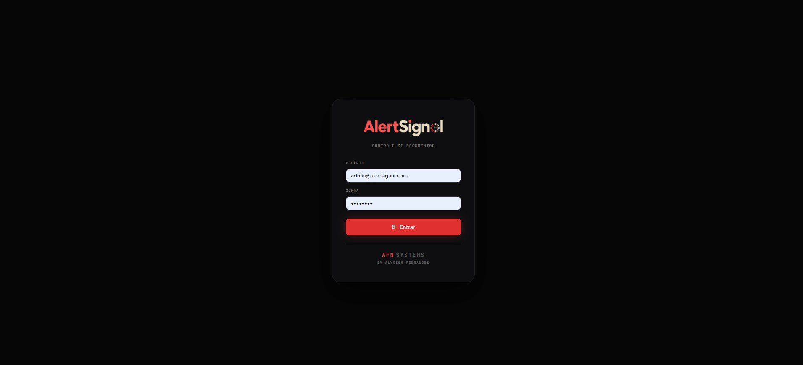
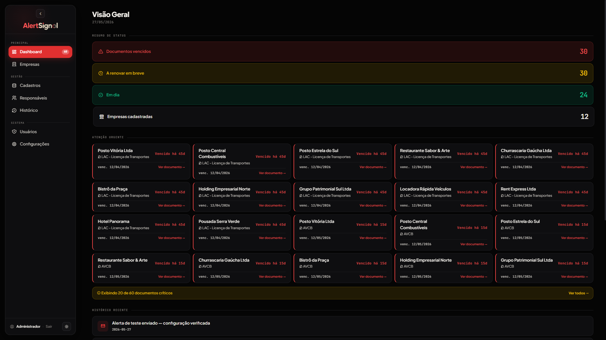
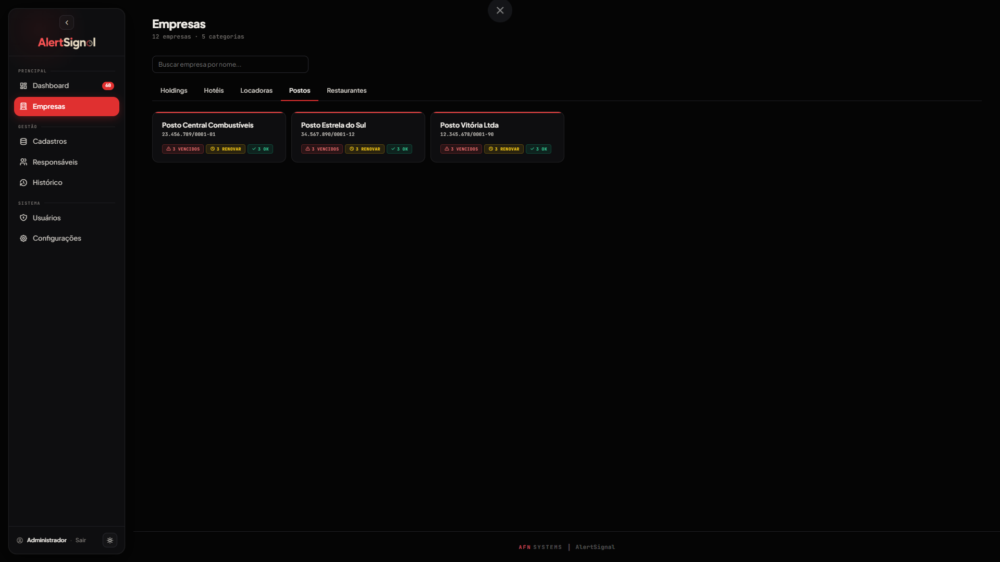
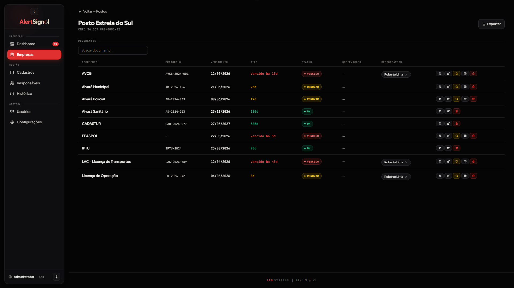
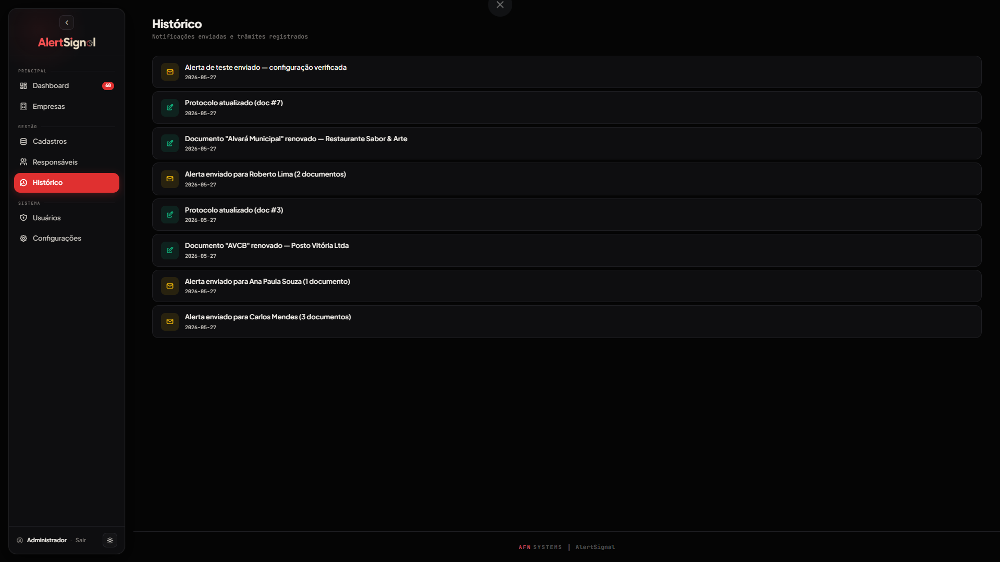

<p align="center">
  
</p>

<p align="center">
  <strong>Document expiration tracking and automated email alerting system.</strong>
</p>

<p align="center">
  
  
  
  
  
</p>

---

AlertSignal is a local web application that tracks business licenses, permits, and regulatory documents — automatically notifying responsible parties before deadlines are missed.

Built as a real-world replacement for a manually maintained spreadsheet, AlertSignal introduces automated alerts, multi-stakeholder notification, and a full audit trail without requiring any cloud infrastructure.

---

## Screenshots

<p align="center">
  
</p>
<p align="center"><em>Login screen</em></p>

<p align="center">
  
</p>
<p align="center"><em>Dashboard — status overview and urgent documents</em></p>

<p align="center">
  
</p>
<p align="center"><em>Companies — organized by category with status indicators</em></p>

<p align="center">
  
</p>
<p align="center"><em>Company detail — document table with expiration tracking</em></p>

<p align="center">
  
</p>
<p align="center"><em>History — full audit log of alerts and transactions</em></p>

---

## Features

- **Automated email alerts** — daily checks at a configurable time; notifications sent at 90, 30, and 7 days before expiration, plus ongoing reminders for already-expired documents
- **Multi-company support** — companies organized by category with per-company document tracking
- **Multiple assignees per document** — each document can have more than one responsible party, reducing the risk of missed alerts
- **Inline protocol editing** — update protocol numbers directly in the document table without navigating away
- **Full history log** — every sent notification and registered transaction is recorded with timestamp
- **Configurable rules** — alert thresholds and send time adjustable through the UI, no code changes needed
- **Excel export** — export all documents to a formatted `.xlsx` file with color-coded status
- **Login-protected** — session-based authentication with admin and viewer roles
- **Collapsible sidebar** — responsive layout that works on any screen size

---

## Tech Stack

| Layer | Technology |
|---|---|
| Backend | Python 3 + Flask |
| Database | SQLite (single file, zero config) |
| Scheduler | APScheduler |
| Email | smtplib + Gmail SMTP over SSL |
| Frontend | Jinja2 templates + vanilla JS |
| Fonts | Plus Jakarta Sans + JetBrains Mono |
| Icons | Tabler Icons |
| Data import | pandas + openpyxl |

---

## Technical Decisions

**SQLite over PostgreSQL** — this is a local, single-machine application with no concurrent writes. SQLite means zero configuration, a single file to back up, and no server to maintain. The right tool for the use case.

**APScheduler over cron** — runs inside the Flask process, works cross-platform (including Windows), and lets the send time be configured through the UI without touching the server.

**No ORM** — raw SQL with parameterized queries keeps the codebase simple and explicit. With a schema this size, an ORM would add abstraction without adding value.

**Vanilla JS over a framework** — the interactivity requirements (modals, inline editing, toast notifications) are modest enough that a framework would be over-engineering. The result is a zero-dependency frontend.

---

## Project Structure

```
alertsignal/
├── app.py                  # Flask server — all routes and business logic
├── database.py             # SQLite schema and connection helpers
├── importar_planilha.py    # One-time Excel importer
├── notificacoes.py         # Alert logic and email dispatch
├── demo_seed.py            # Demo data seeder
├── requirements.txt        # Python dependencies
├── .env                    # Environment variables (not committed)
├── INICIAR.bat             # Windows launcher
├── static/
│   ├── img/                # Logo and OG image
│   ├── js/app.js
│   └── favicon/            # Favicon pack
├── docs/
│   └── screenshots/        # UI screenshots
└── templates/
    ├── base.html           # Global styles and CSS variables
    ├── layout.html         # Collapsible sidebar layout
    ├── login.html
    ├── dashboard.html
    ├── empresas.html
    ├── empresa_detalhe.html
    ├── cadastros.html
    ├── responsaveis.html
    ├── historico.html
    ├── configuracoes.html
    ├── perfil.html
    └── usuarios.html
```

---

## Getting Started

### Requirements

- Python 3.8 or higher
- Internet connection on first run (to install dependencies)

### Installation

1. Clone the repository
2. Create a `.env` file in the project root:
   ```
   SECRET_KEY=your-long-secret-key-here
   ```
3. On Windows, double-click `INICIAR.bat`

The launcher installs all dependencies, starts the server, and opens the browser automatically.

### Manual start (any OS)

```bash
pip install -r requirements.txt
python app.py
```

Then open `http://localhost:5000` in your browser.

### Demo credentials

The repository includes a pre-seeded demo database with fictional data:

```
Email:    admin@alertsignal.com
Password: demo2024
```

To reset and re-seed the demo data:

```bash
python demo_seed.py --reset
```

---

## Email Configuration

AlertSignal sends alerts through a Gmail account using an App Password.

1. Go to [myaccount.google.com](https://myaccount.google.com) → Security → 2-Step Verification
2. Search for **App passwords** → create one named "AlertSignal"
3. Copy the 16-character password
4. In AlertSignal, go to **Settings** and fill in the Gmail address and App Password
5. Use **Send test** to verify

---

## Database Schema

```
usuarios              — system users (login)
categorias            — company categories
empresas              — companies with CNPJ and category
documentos            — documents per company (type, protocol, expiration, status)
responsaveis          — people who receive notifications
documento_responsavel — N:N link between documents and assignees
historico             — audit log of alerts sent and transactions
configuracoes         — key/value settings store
```

---

## Known Limitations

- No CSRF protection on forms — acceptable for a local, login-protected app; would add Flask-WTF before any public deployment
- App Password stored as plain text in the database — would encrypt with `cryptography.fernet` for production use

---

## Author

Developed by **Alyssom Fernandes** — first Python project, built to solve a real operational problem and demonstrate full-stack capability across backend logic, database design, scheduled tasks, and email automation.
