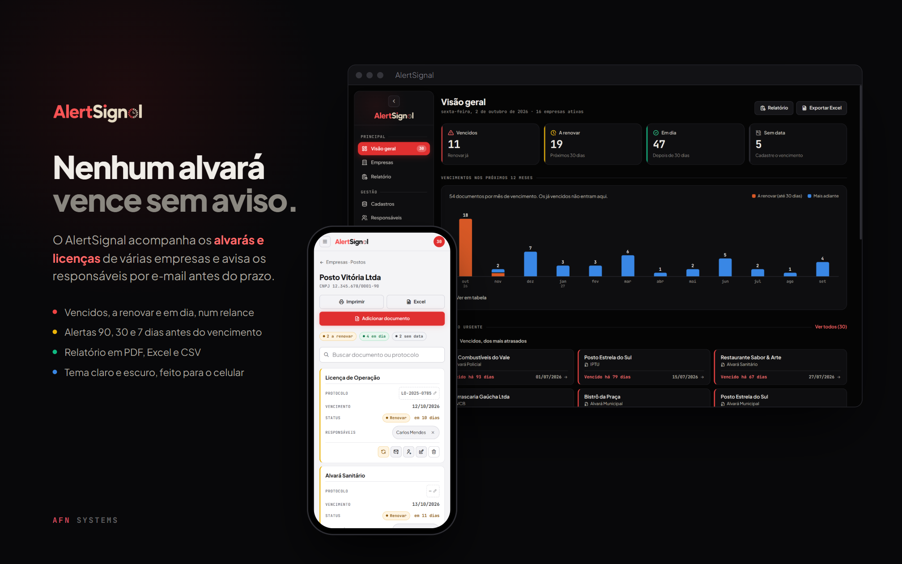
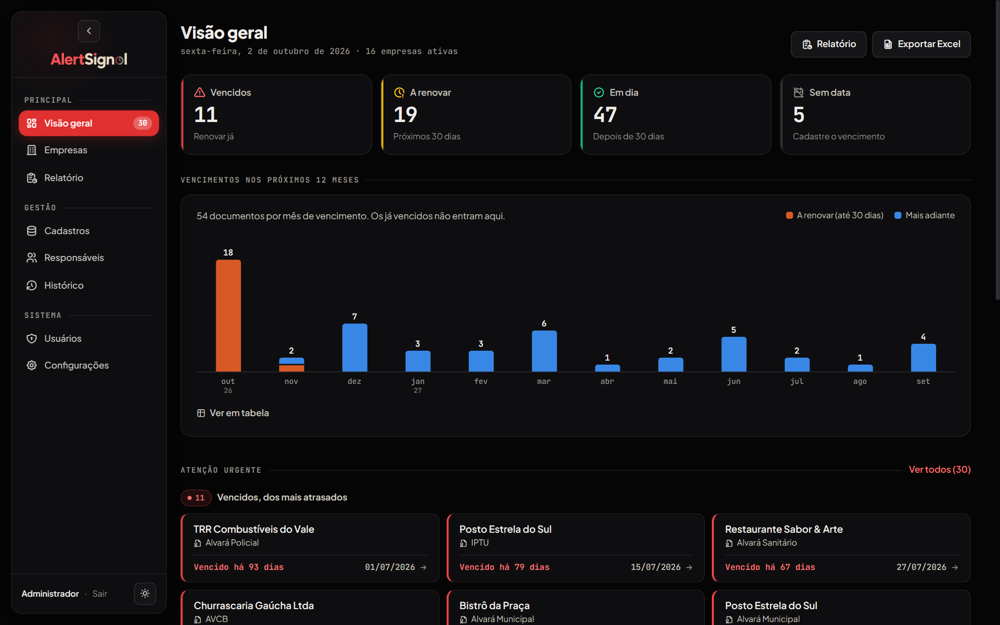
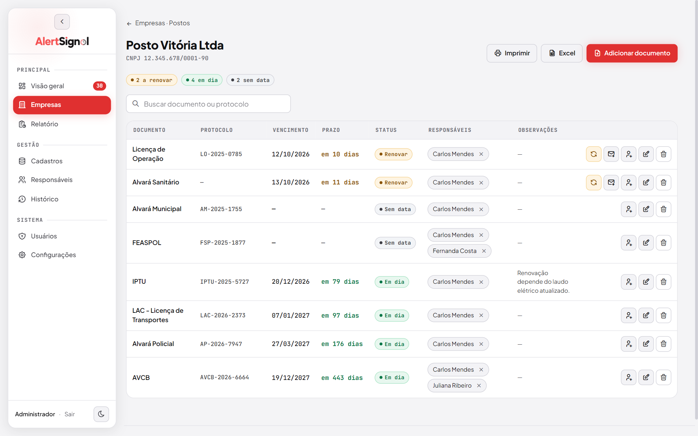
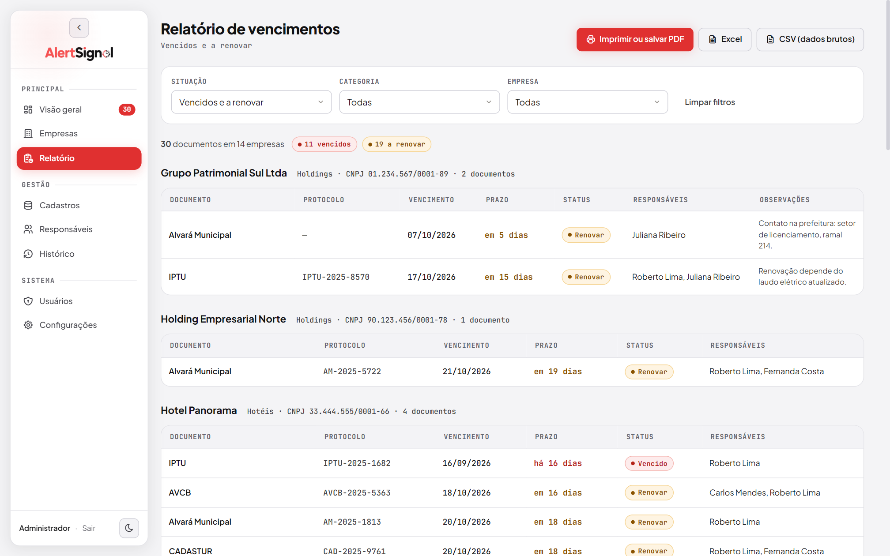
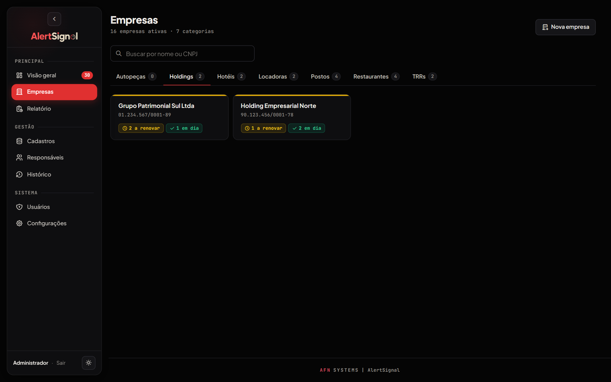
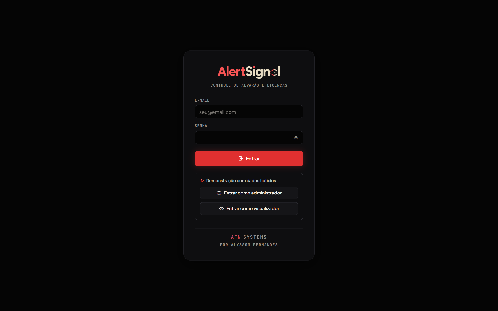
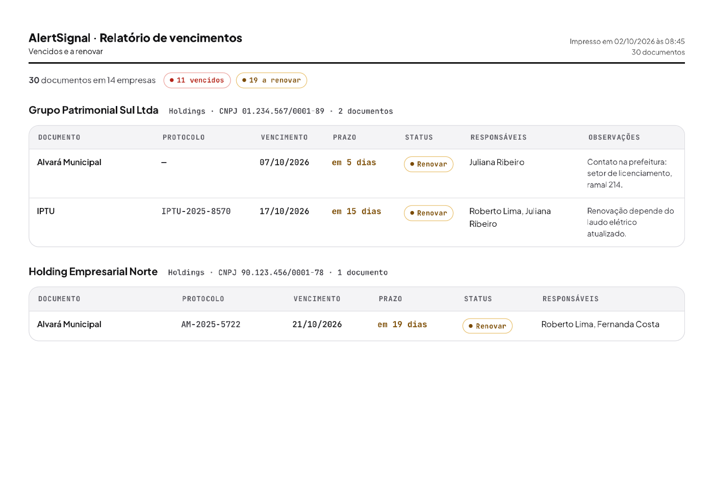
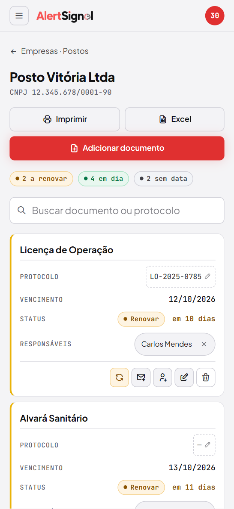
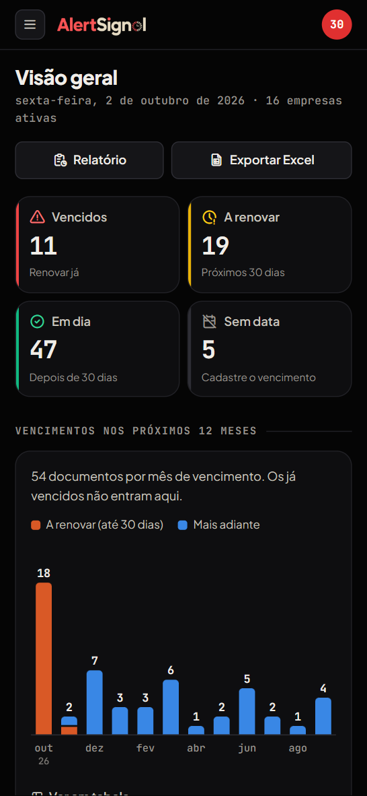

# AlertSignal



AlertSignal tracks the business licenses, permits and regulatory documents
of a group of companies and emails the people in charge before anything
expires. It replaced a spreadsheet kept by hand: it runs on one machine
inside the company, with no cloud, and keeps everything in a single SQLite
file. The interface is in Brazilian Portuguese.

[](https://github.com/alyssom-fernandes/AlertSignal/actions/workflows/testes.yml)


This README is also available in [Portuguese](README.pt-br.md).

## In 30 seconds

1. Run the demo, with fictitious data and no email ever sent:
   ```bash
   pip install -r requirements.txt
   python app.py --demo
   ```
   On Windows, just double-click `DEMONSTRACAO.bat`.
2. Open `http://localhost:5000` and click **Entrar como administrador** (sign in as admin).
3. On the overview, open a document under **Atenção urgente**, renew it, and
   watch the row move and the history record who did it.
4. In **Relatório**, pick "Vencidos e a renovar" and use **Imprimir ou salvar PDF**.
5. Sign out and sign in as **visualizador** (viewer): everything is still visible, but read-only.

## Screens

Captured from demo mode.

| Overview, dark theme | Company page, light theme |
|---|---|
|  |  |
| **Report, light theme** | **Companies, dark theme** |
|  |  |
| **Sign in, with the demo buttons** | **The report as a PDF** |
|  |  |

| On a phone, light theme | On a phone, dark theme |
|---|---|
|  |  |

---

## Features

- **Automated email alerts.** A daily check at a configurable time sends notices 90, 30 and 7 days before expiration, plus daily reminders for anything already expired. The email groups documents by urgency and includes a plain-text version.
- **Many companies and categories.** Each company has its own documents; categories group them by line of business.
- **More than one assignee per document**, so no alert depends on a single person.
- **Renew, edit and update protocol numbers on the company page**, with the history recording who did what.
- **Expiration report** filtered by status, category and company, printed in landscape or saved as PDF.
- **Export** to a formatted Excel file (status colors, filter, totals, print setup) and to semicolon CSV, which Excel in Portuguese opens straight into columns.
- **Chart of expirations over the next 12 months**, with hover details and a table view.
- **Two access levels.** Admins can change data; viewers can only look, enforced on the server too.
- **Dark and light themes**, following the system on the first visit, and a phone layout.
- **Demo mode** with fictitious data in a separate database.

---

## Getting started

### Requirements

- Python 3.8 or later

### Demo (fictitious data)

```bash
pip install -r requirements.txt
python app.py --demo
```

Open `http://localhost:5000` and use **Entrar como administrador** (admin) or **Entrar como visualizador** (viewer). The demo writes to a separate `demo.db`, rebuilt on every start, and never sends email. On Windows, `DEMONSTRACAO.bat` does the same.

### Real use

1. Create a `.env` file in the project root:
   ```
   SECRET_KEY=a-long-random-key
   ```
2. Run `python app.py` (or double-click `INICIAR.bat` on Windows).
3. Sign in with `admin@grupozen.com.br` and password `zen2024`, then change the password under **Meu perfil**.

Data lives in `zen.db`, which is not committed. If an `ALVARAS_GRUPO_ZEN.xlsx` spreadsheet is in the folder, it is imported on the first run.

> **Upgrading an install that runs from an old clone:** earlier versions kept `zen.db` in the repository. Back up `zen.db` before `git pull`, and if git refuses to update because of it, restore the backup after the pull. Never run `git reset --hard` or `git checkout -- zen.db` on that machine without the backup.

### Tests

```bash
python -m unittest discover -s tests -v
```

The same tests run on GitHub Actions on every push. They use demo mode on a temporary database and cover the pages, viewer permissions, CSRF protection, exports and the alert email.

---

## Email setup

AlertSignal sends through Gmail with an App Password.

1. At [myaccount.google.com](https://myaccount.google.com), turn on 2-Step Verification.
2. Search for **App passwords** and create one named "AlertSignal".
3. In AlertSignal, open **Configurações**, fill in the address and the App Password, and save.
4. Use **Enviar teste** to check.
5. Optional: set **Endereço do sistema** (e.g. `http://192.168.0.10:5000`) so the email gets an "Abrir no AlertSignal" button.

---

## Tech stack

| Layer | Technology |
|---|---|
| Server | Python 3 + Flask |
| Database | SQLite |
| Scheduler | APScheduler |
| Email | smtplib + Gmail (SSL) |
| Interface | Jinja2, CSS and plain JavaScript |
| Fonts and icons | Plus Jakarta Sans, JetBrains Mono and Tabler Icons |
| Spreadsheets | openpyxl (export) and pandas (import) |

---

## Technical decisions

**SQLite over PostgreSQL.** A local app on one machine with few writes. SQLite needs no setup, and a backup is a file copy.

**APScheduler over cron.** It runs inside the Flask process, works on Windows and lets the send time be changed from the settings page.

**Plain SQL, no ORM.** Short, explicit, parameterized queries. With eight tables, an ORM would only add layers.

**No front-end framework.** Modals use `<dialog>`; inline editing, filters and notices fit in a few functions. The chart is built with HTML and CSS and stays readable on a phone.

**CSRF protection without a dependency.** A per-session token goes into every form and every data-changing `fetch`.

---

## Project structure

```
alertsignal/
├── app.py                  # Routes, permissions, report and exports
├── database.py             # SQLite schema and connection
├── notificacoes.py         # Alert rules and email sending
├── demo_seed.py            # Demo-mode fictitious data
├── importar_planilha.py    # One-time import of the old spreadsheet
├── tests/test_rotas.py     # Tests (unittest)
├── .github/workflows/      # Tests on GitHub Actions on every push
├── docs/telas/             # Images for this README and the link preview
├── INICIAR.bat             # Starts the app on Windows
├── DEMONSTRACAO.bat        # Starts the demo on Windows
├── static/
│   ├── css/app.css         # Styles, themes, phone layout and print
│   ├── js/app.js           # Modals, confirmations, tabs, theme and menu
│   └── img/                # Logos (dark and light theme versions)
└── templates/              # Jinja pages (layout, screens, report and errors)
```

---

## Database

```
usuarios              app users (sign in and access level)
categorias            lines of business
empresas              companies, with CNPJ, category and active flag
documentos            documents per company (type, protocol, expiration, status)
responsaveis          people who receive alerts
documento_responsavel who is in charge of each document
historico             alerts sent and changes, with date and author
configuracoes         email, send time and alert thresholds
```

---

## Known limitations

- The Gmail App Password is stored as plain text in the database. For use outside the company network, it should be encrypted with `cryptography.fernet`.
- Flask's built-in server is fine on a local network; for internet access, put the app behind a server such as Waitress or Gunicorn, with HTTPS.

---

## License

[MIT](LICENSE).

---

## Author

Built by **Alyssom Fernandes**. A first Python project, made to solve a real operational problem and to show the whole stack: business rules, database design, scheduled jobs, email and interface.
