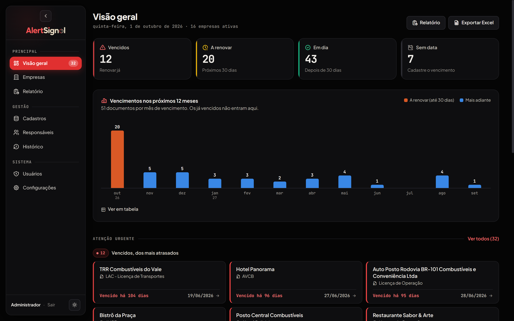
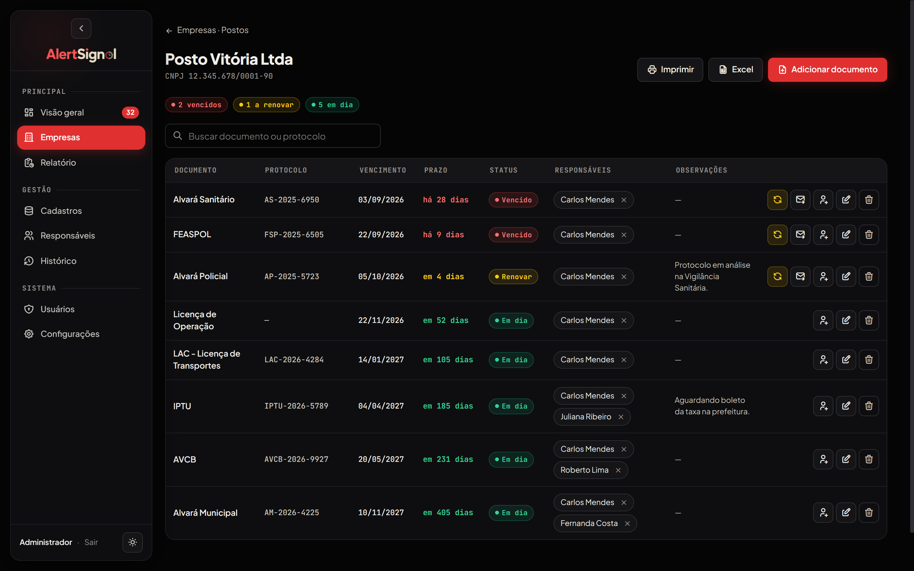
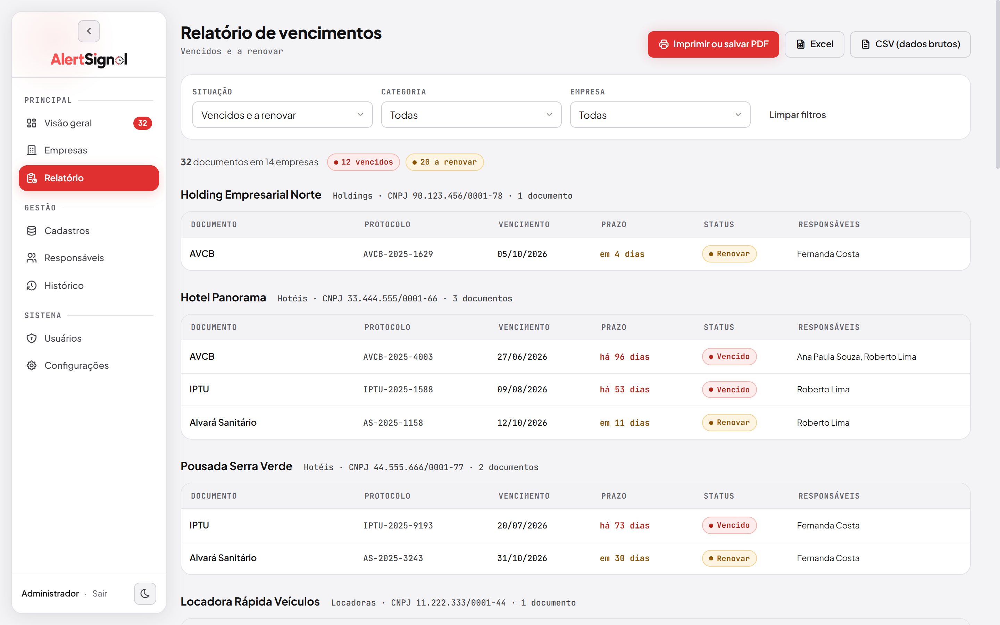
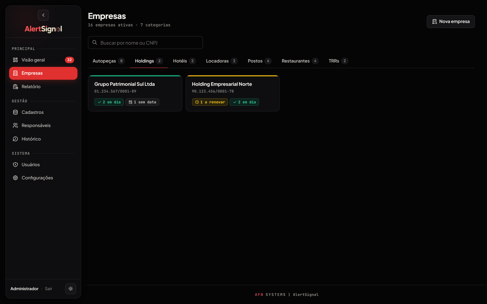
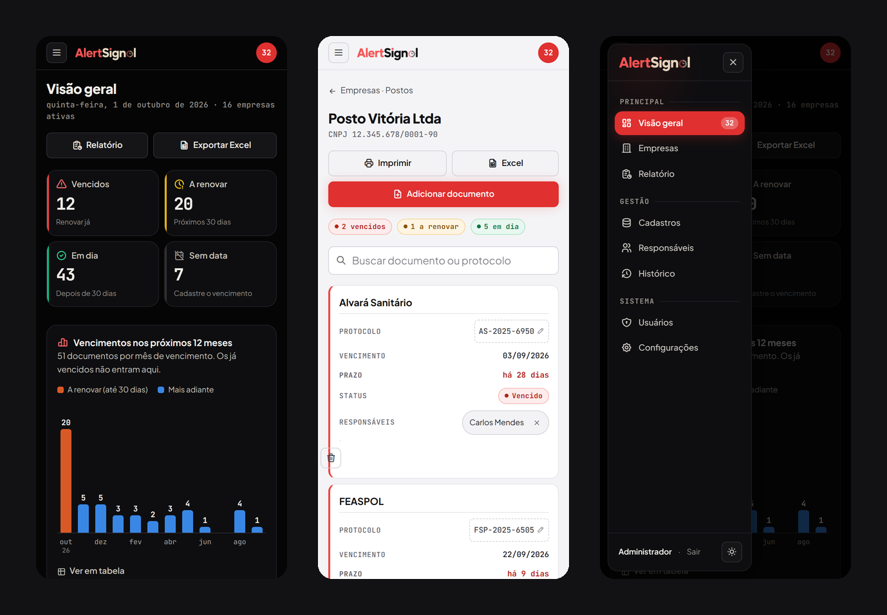
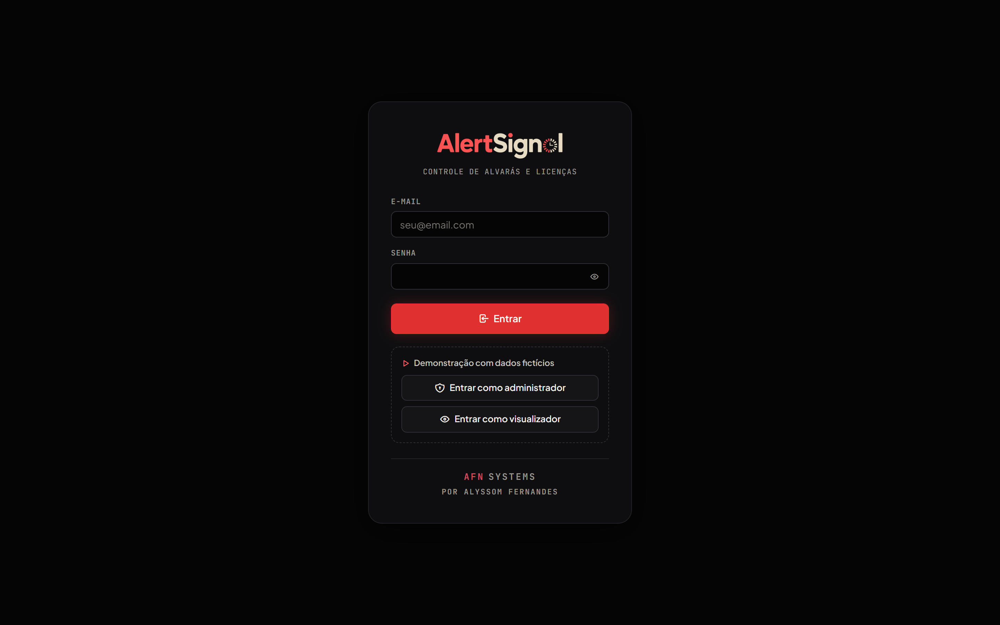

<p align="center">
  
</p>

<p align="center">
  <strong>Controle de vencimento de alvarás e licenças, com alertas automáticos por e-mail.</strong>
</p>

<p align="center">
  
  
  
  
  
</p>

<p align="center"><a href="README.md">English</a> · Português</p>

---

O AlertSignal acompanha os alvarás, licenças e documentos regulatórios de um grupo de empresas e avisa os responsáveis por e-mail antes que algum vença.

Ele substituiu uma planilha mantida à mão. Roda numa máquina da empresa, sem nuvem, e guarda tudo num único arquivo SQLite.

---

## Capturas

<p align="center">
  
</p>
<p align="center"><em>Visão geral: totais por situação, vencimentos dos próximos 12 meses e o que precisa de atenção agora</em></p>

<p align="center">
  
</p>
<p align="center"><em>Página da empresa: documentos do mais urgente para o em dia, com renovação, edição e responsáveis</em></p>

<p align="center">
  
</p>
<p align="center"><em>Relatório de vencimentos no tema claro, pronto para imprimir ou salvar em PDF</em></p>

<p align="center">
  
</p>
<p align="center"><em>Empresas separadas por categoria, com a situação de cada uma</em></p>

<p align="center">
  
</p>
<p align="center"><em>No celular: tabelas viram cartões e o menu vira gaveta</em></p>

<p align="center">
  
</p>
<p align="center"><em>Entrada, com os botões da demonstração</em></p>

---

## Funcionalidades

- **Alertas automáticos por e-mail.** Verificação diária num horário configurável, com avisos 90, 30 e 7 dias antes do vencimento e lembretes diários para o que já venceu. O e-mail agrupa os documentos por urgência e tem versão em texto simples.
- **Várias empresas e categorias.** Cada empresa tem os próprios documentos, e as categorias organizam por ramo (postos, restaurantes, hotéis...).
- **Mais de um responsável por documento**, para nenhum alerta depender de uma pessoa só.
- **Renovação, edição e protocolo na própria tela da empresa**, com o histórico registrando quem fez o quê.
- **Relatório de vencimentos** com filtros por situação, categoria e empresa, impressão em paisagem e "salvar como PDF".
- **Exportação** para Excel formatado (cores por situação, filtro, totais, pronto para imprimir) e para CSV com ponto e vírgula, que o Excel em português abre direto em colunas.
- **Gráfico dos vencimentos dos próximos 12 meses**, com dica ao passar o mouse e versão em tabela.
- **Dois níveis de acesso.** Administradores alteram; visualizadores só consultam, e o servidor também bloqueia.
- **Tema escuro e claro**, que segue o sistema na primeira visita, e layout para celular.
- **Modo demonstração** com dados fictícios, num banco separado.

---

## Como rodar

### Requisitos

- Python 3.8 ou superior

### Demonstração (dados fictícios)

```bash
pip install -r requirements.txt
python app.py --demo
```

Abra `http://localhost:5000` e use os botões **Entrar como administrador** ou **Entrar como visualizador**. A demonstração grava num `demo.db` separado, recriado a cada início, e não envia nenhum e-mail. No Windows, dá para usar o `DEMONSTRACAO.bat`.

### Uso real

1. Crie um arquivo `.env` na raiz do projeto:
   ```
   SECRET_KEY=uma-chave-longa-e-aleatoria
   ```
2. Rode `python app.py` (ou dê duplo clique em `INICIAR.bat` no Windows).
3. Entre com `admin@grupozen.com.br` e a senha `zen2024` e troque a senha em **Meu perfil**.

Os dados ficam em `zen.db`, que não vai para o git. Se houver uma planilha `ALVARAS_GRUPO_ZEN.xlsx` na pasta, ela é importada na primeira execução.

> **Atualizando uma instalação feita a partir de um clone antigo:** versões anteriores guardavam o `zen.db` no repositório. Antes do `git pull`, faça uma cópia do `zen.db` e, se o git recusar a atualização por causa dele, restaure a cópia depois do pull. Nunca use `git reset --hard` ou `git checkout -- zen.db` nessa máquina sem a cópia.

### Testes

```bash
python -m unittest discover -s tests -v
```

Os testes rodam no modo demonstração, num banco temporário, e cobrem as páginas, as permissões do visualizador, a proteção contra CSRF, as exportações e o e-mail de alerta.

---

## Configuração do e-mail

O AlertSignal envia pelo Gmail com uma senha de app.

1. Em [myaccount.google.com](https://myaccount.google.com), ative a verificação em duas etapas.
2. Procure **Senhas de app** e crie uma chamada "AlertSignal".
3. No AlertSignal, abra **Configurações**, preencha o e-mail e a senha de app e salve.
4. Use **Enviar teste** para conferir.
5. Opcional: informe o **Endereço do sistema** na rede (ex.: `http://192.168.0.10:5000`) para o e-mail ganhar o botão "Abrir no AlertSignal".

---

## Tecnologias

| Camada | Tecnologia |
|---|---|
| Servidor | Python 3 + Flask |
| Banco de dados | SQLite |
| Agendador | APScheduler |
| E-mail | smtplib + Gmail (SSL) |
| Interface | Jinja2, CSS e JavaScript sem framework |
| Fontes e ícones | Plus Jakarta Sans, JetBrains Mono e Tabler Icons |
| Planilhas | openpyxl (exportação) e pandas (importação) |

---

## Decisões técnicas

**SQLite em vez de PostgreSQL.** É uma aplicação local, numa máquina só e com poucas escritas. SQLite não pede configuração, e o backup é copiar um arquivo.

**APScheduler em vez de cron.** Roda dentro do processo do Flask, funciona no Windows e deixa o horário do envio ser trocado pela própria tela.

**SQL direto, sem ORM.** Consultas parametrizadas, explícitas e curtas. Com oito tabelas, um ORM só acrescentaria camadas.

**JavaScript sem framework.** Modais com `<dialog>`, edição na linha, filtros e avisos cabem em poucas funções. O gráfico é feito com HTML e CSS e continua legível no celular.

**Proteção contra CSRF sem dependência.** Um token por sessão vai em todo formulário e em todo `fetch` que altera dados.

---

## Estrutura do projeto

```
alertsignal/
├── app.py                  # Rotas, permissões, relatório e exportações
├── database.py             # Esquema do SQLite e conexão
├── notificacoes.py         # Regras dos alertas e envio de e-mail
├── demo_seed.py            # Dados fictícios do modo demonstração
├── importar_planilha.py    # Importação da planilha antiga (uma vez)
├── tests/test_rotas.py     # Testes (unittest)
├── INICIAR.bat             # Inicia o sistema no Windows
├── DEMONSTRACAO.bat        # Inicia a demonstração no Windows
├── static/
│   ├── css/app.css         # Estilos, temas, celular e impressão
│   ├── js/app.js           # Modais, confirmações, abas, tema e menu
│   └── img/                # Logos (versões para tema escuro e claro)
└── templates/              # Páginas Jinja (layout, telas, relatório e erros)
```

---

## Banco de dados

```
usuarios              usuários do sistema (login e nível)
categorias            ramos das empresas
empresas              empresas, com CNPJ, categoria e situação (ativa ou inativa)
documentos            documentos de cada empresa (tipo, protocolo, vencimento, situação)
responsaveis          pessoas que recebem os alertas
documento_responsavel quem responde por cada documento
historico             alertas enviados e alterações, com data e autor
configuracoes         e-mail, horário e prazos dos alertas
```

---

## Limitações conhecidas

- A senha de app do Gmail fica em texto no banco. Para uso fora da rede da empresa, o caminho seria cifrar com `cryptography.fernet`.
- O servidor embutido do Flask atende bem a rede local; para acesso pela internet, o certo é colocar atrás de um servidor como Waitress ou Gunicorn, com HTTPS.

---

## Licença

[MIT](LICENSE).

---

## Autor

Desenvolvido por **Alyssom Fernandes**. Primeiro projeto em Python, feito para resolver um problema real de operação e mostrar o trabalho de ponta a ponta: regras de negócio, banco de dados, tarefas agendadas, e-mail e interface.
